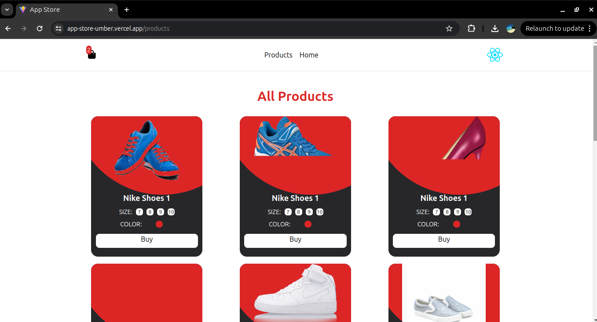
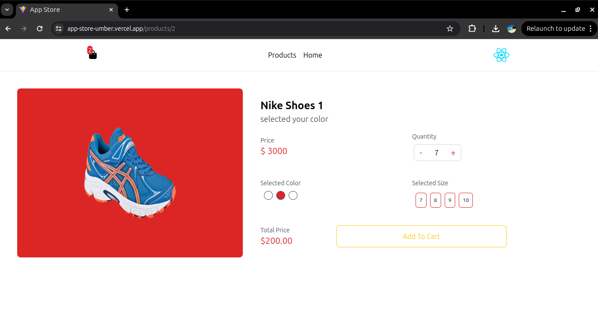
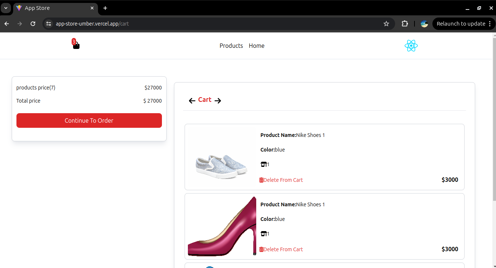

# 🛒 App Store - React E-commerce Project

A simple and clean e-commerce store built with React, Vite, and Tailwind CSS.  
This project demonstrates listing products, adding/removing items from the cart, and responsive design.  
Ideal for portfolio showcasing and learning core frontend concepts.


## ✨ Features

- Product listing with dynamic data  
- Add products to the shopping cart  
- Remove products from the cart  
- Responsive design using Tailwind CSS  
- Deployed live on Vercel

## 🔗 Live Demo

👉 [View the live demo](https://app-store-umber.vercel.app)

## 📸 Screenshots
 
  
 

## 🛠 Technologies Used React

- Vite

- Tailwind CSS

- React Hooks (useState, useEffect)

- Vercel (deployment)


## 📁 Project Structure

src/
├── components/    # Reusable UI components like ProductCard, Header, Cart
├── pages/         # Main pages (e.g. Store page)
├── assets/        # Static files like images
├── App.jsx        # Root component
└── main.jsx       # Entry point


## 📌 Development Notes

State management with React hooks for cart functionality

Component-based design for maintainability

Tailwind CSS utility classes for fast styling and responsiveness

## 🚀 Future Enhancements

- User Authentication  
- Product Search & Filtering  
- Pagination or Infinite Scroll  
- Shopping Cart Persistence  
- Order Management  
- Admin Panel  
- Payment Integration  
- Responsive & Accessibility Improvements  
- Unit & Integration Testing  
- Performance Optimization  
- Dark Mode

## ⚙️ Installation & Setup

```bash
git clone https://github.com/melikaeslahi/app-store.git
cd app-store
npm install
npm run dev

